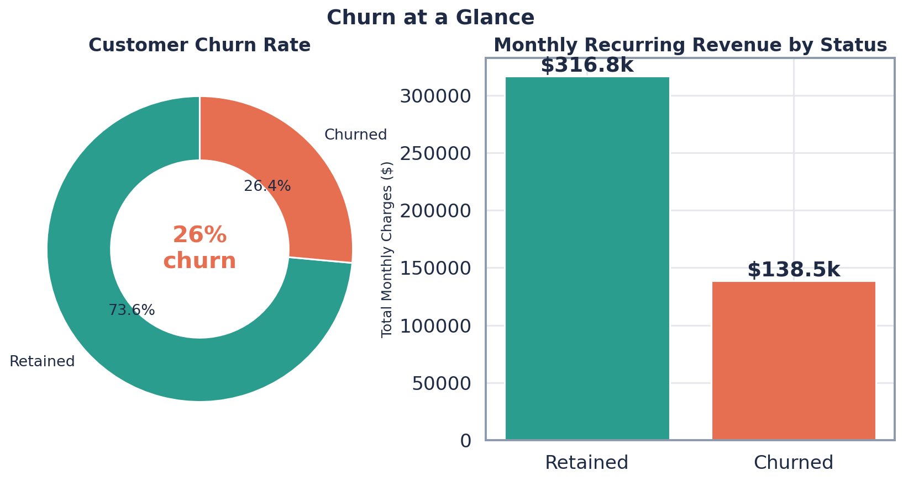
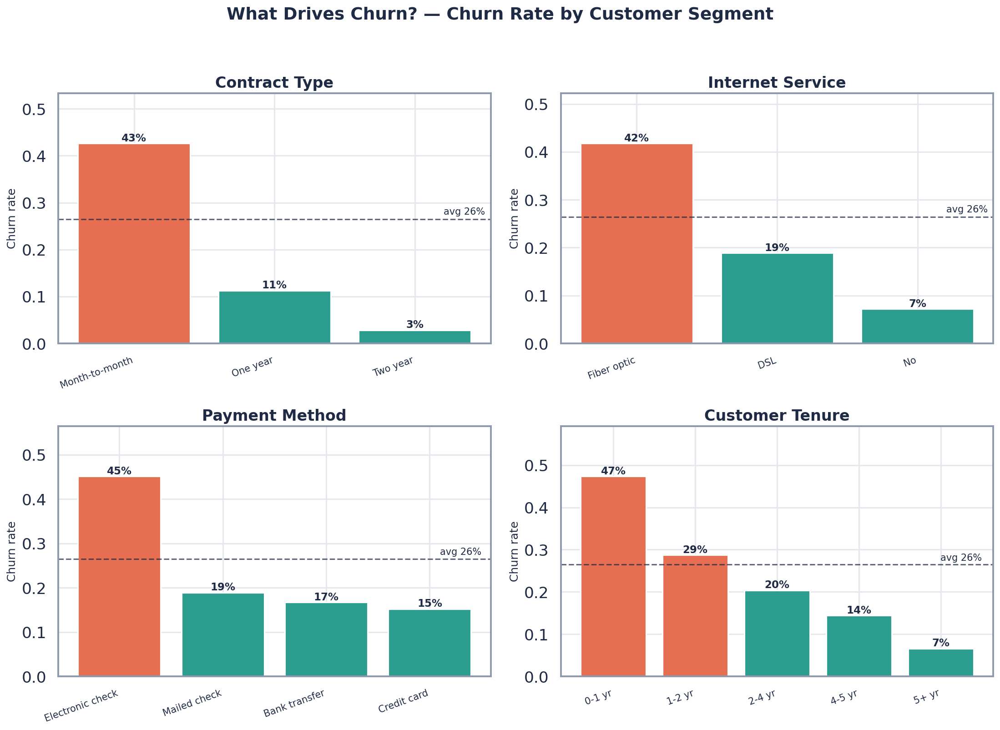
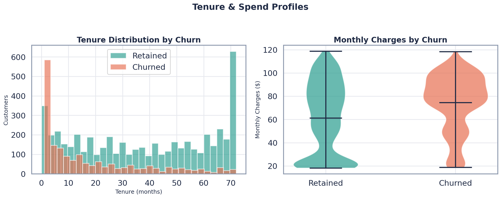
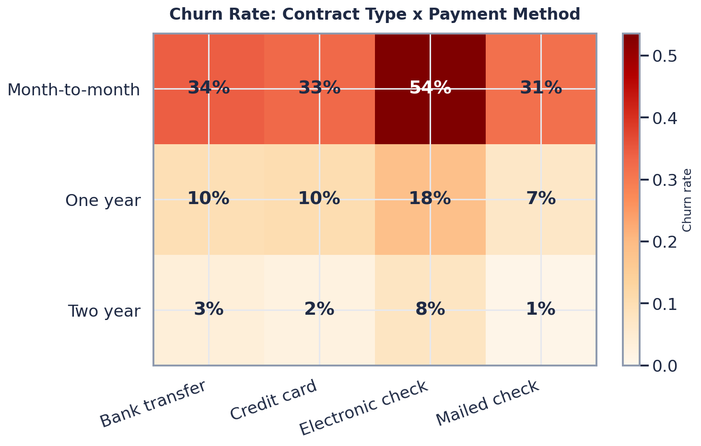
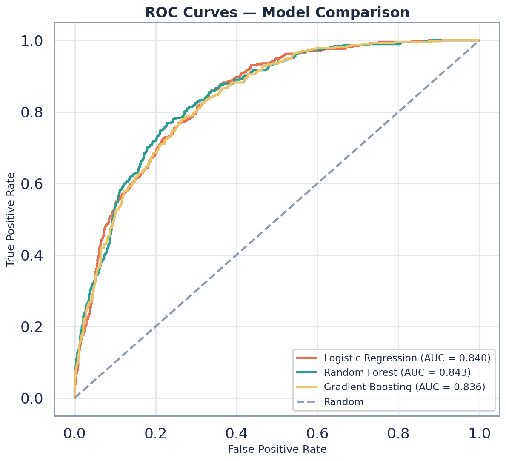
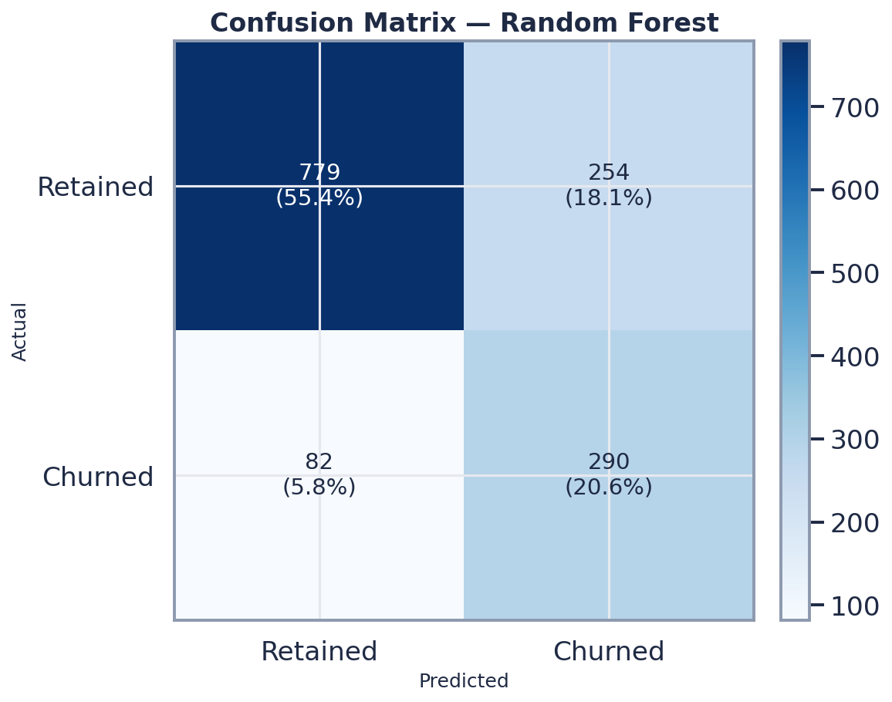
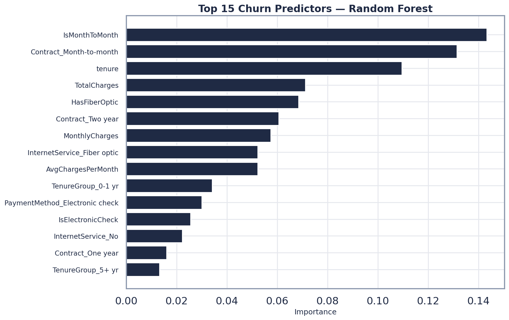
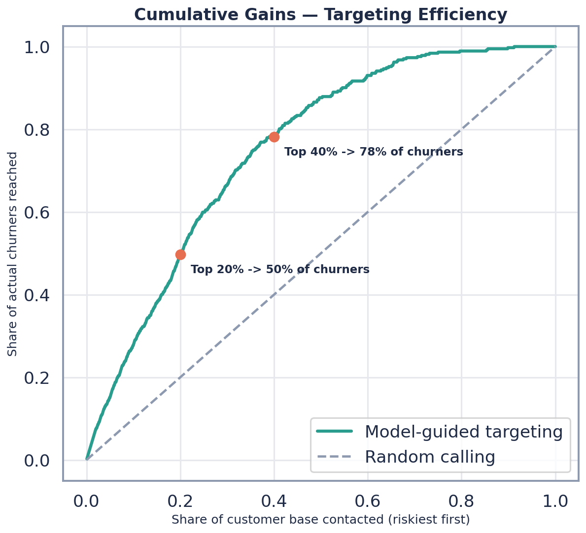

# 📉 Telco Customer Churn — Prediction & Retention Strategy

> An end-to-end data science case study that identifies **which customers are about to leave, why they leave, and what a targeted retention campaign is worth in dollars.**

<p align="left">
  
  
  
  
  
</p>

---

## 🧭 TL;DR (for recruiters in a hurry)

A telecom provider loses **26% of its customers**, putting **~$1.6M of annual recurring revenue at risk** across the base. I built a churn-prediction pipeline that flags at-risk customers with **0.84 ROC-AUC and 78% recall**, and translated it into a retention play: **call the riskiest 20% of customers → reach ~50% of all churners → ~99% ROI** on the campaign.

| | |
|---|---|
| **Business problem** | Reduce involuntary revenue loss from customer churn |
| **Dataset** | IBM Telco Customer Churn — 7,043 customers × 21 features ([source](https://github.com/IBM/telco-customer-churn-on-icp4d)) |
| **Best model** | Random Forest — **ROC-AUC 0.843**, Recall **0.78**, F1 0.63 |
| **Headline insight** | Month-to-month contracts churn **14× more** than two-year contracts (43% vs 3%) |
| **Business value** | ~$27k net benefit on the test set alone; **~99% campaign ROI** |

---

## 📚 Table of Contents
1. [Business Problem](#-1-business-problem)
2. [Dataset](#-2-dataset)
3. [Project Structure](#-3-project-structure)
4. [How to Run](#-4-how-to-run)
5. [Data Cleaning & Feature Engineering](#-5-data-cleaning--feature-engineering)
6. [Exploratory Data Analysis](#-6-exploratory-data-analysis)
7. [Modeling & Evaluation](#-7-modeling--evaluation)
8. [Business Impact & ROI](#-8-business-impact--roi)
9. [Recommendations](#-9-business-recommendations)
10. [Tech Stack](#-10-tech-stack)

---

## 🎯 1. Business Problem

For a subscription business, **retaining an existing customer is 5–7× cheaper than acquiring a new one.** This telecom provider churns roughly **1 in 4 customers**, and because churners tend to be *higher-paying* customers, the revenue impact is disproportionate.

The business needs answers to three questions:

1. **How big is the problem?** — quantify churn and the revenue exposed to it.
2. **Why do customers leave?** — find the segments and behaviours that drive churn.
3. **What should we do about it?** — rank customers by risk so a limited retention budget is spent where it pays off.

This project answers all three: a descriptive layer (EDA), a predictive layer (ML), and a prescriptive layer (a costed retention strategy with ROI).

---

## 📦 2. Dataset

- **Source:** [IBM Telco Customer Churn](https://github.com/IBM/telco-customer-churn-on-icp4d) (also widely mirrored on Kaggle).
- **Size:** 7,043 customers, 21 columns.
- **Target:** `Churn` (Yes / No) — **26.4%** positive class.
- **Feature groups:**
  - *Demographics* — gender, senior citizen, partner, dependents.
  - *Account* — tenure, contract type, paperless billing, payment method, monthly & total charges.
  - *Services* — phone, multiple lines, internet type, online security/backup, device protection, tech support, streaming.

---

## 🗂️ 3. Project Structure

```
telco-churn/
├── data/
│   ├── raw/telco_churn.csv               # original dataset (immutable)
│   └── processed/telco_churn_clean.csv   # cleaned + engineered (generated)
├── src/
│   ├── config.py                         # paths, business levers, visual theme
│   ├── data_preprocessing.py             # cleaning + feature engineering
│   ├── eda.py                            # exploratory visualisations
│   ├── train_model.py                    # model training + evaluation
│   └── business_impact.py                # revenue-at-risk + ROI + call list
├── reports/
│   ├── figures/                          # all generated charts (PNG)
│   ├── model_metrics.csv                 # model comparison table
│   └── business_impact.csv               # ROI summary
├── models/
│   ├── best_model.joblib                 # serialized winning pipeline
│   └── retention_priority_list.csv       # ranked "who to call" list
├── notebooks/churn_analysis.ipynb        # narrative walkthrough
├── main.py                               # one-command end-to-end pipeline
├── requirements.txt
└── README.md
```

---

## ⚙️ 4. How to Run

```bash
# 1. install dependencies
pip install -r requirements.txt

# 2. run the entire case study end-to-end
python main.py
```

`main.py` executes the full pipeline — **cleaning → EDA → model training → business impact** — and regenerates every figure, metric, and CSV in `reports/` and `models/`. Each module can also be run on its own (e.g. `python src/eda.py`).

---

## 🧹 5. Data Cleaning & Feature Engineering

**Cleaning steps** (in `data_preprocessing.py`):
- Converted `TotalCharges` from text to numeric and resolved **11 blank values** belonging to brand-new (tenure = 0) customers.
- Relabelled cryptic categories (`SeniorCitizen` 0/1 → No/Yes; collapsed *"No internet service"* / *"No phone service"* → *"No"*) so charts and encodings stay clean.
- Dropped `customerID` (leakage-free) and removed 22 duplicate rows → **7,021 analysis-ready customers**.

**Engineered features** that sharpen the signal:
| Feature | Why it matters |
|---|---|
| `TenureGroup` | Turns tenure into a lifecycle stage (0–1 yr … 5+ yr) |
| `NumAddOnServices` | Engagement proxy — counts value-added subscriptions |
| `AvgChargesPerMonth` | Separates high-value from low-value churners |
| `IsMonthToMonth`, `IsElectronicCheck`, `HasFiberOptic` | Direct flags for the three strongest churn signals |

---

## 📊 6. Exploratory Data Analysis

### Churn at a glance
**26% of customers churn**, and they account for a disproportionate slice of monthly recurring revenue.



### What drives churn?
The single clearest story in the data: **contract type, internet service, payment method, and tenure** dominate churn risk.



> **Read this chart:** bars above the dashed line churn *worse* than average.
> - **Month-to-month contracts churn at 43%** vs **3%** on two-year contracts.
> - **Fiber-optic** customers churn at **42%** — a red flag for price/quality perception.
> - **Electronic-check** payers churn at **45%**, far above auto-pay methods.
> - **First-year customers churn at 47%**; loyalty compounds fast after that.

### Tenure & spend profiles
Churners are overwhelmingly **new** and skew toward **higher monthly charges** — exactly the customers worth saving.



### Where risk concentrates
A churn-rate heatmap across **contract × payment method** pinpoints the exact micro-segment to target first.



---

## 🤖 7. Modeling & Evaluation

Three models were trained on an 80/20 stratified split inside a leakage-safe scikit-learn `Pipeline` (scaling + one-hot encoding). Because churn is the minority class and **missing a churner is costlier than a false alarm**, models use `class_weight="balanced"` and are ranked by **ROC-AUC** with a close eye on **recall**.

| Model | Accuracy | Precision | Recall | F1 | ROC-AUC |
|---|---|---|---|---|---|
| **Random Forest** ⭐ | 0.761 | 0.533 | **0.780** | 0.633 | **0.843** |
| Logistic Regression | 0.740 | 0.505 | 0.774 | 0.611 | 0.840 |
| Gradient Boosting | 0.796 | 0.649 | 0.497 | 0.563 | 0.836 |

**Why Random Forest wins for the business:** it has the best ROC-AUC *and* the best recall — it catches **78% of customers who actually churn**, which is what a retention program lives or dies on. Gradient Boosting is more "accurate" overall but only finds half the churners, making it the wrong tool here.

<p align="center">
  
  
</p>

### What the model learned
The top predictors mirror the EDA exactly — a healthy sign the model is learning real business logic, not noise.



---

## 💰 8. Business Impact & ROI

A model is only useful if it changes a decision. Using **transparent, adjustable assumptions** (retention offer ≈ \$8/customer/month, 30% save rate, 12-month value horizon — all in `config.py`), the pipeline converts probabilities into money.

**On the hold-out test set (1,405 customers):**
- **372 churners** → **\$27k/month** (~\$324k/year annualised) of revenue at risk.
- **Strategy:** instead of mass-discounting, call only the **riskiest 20%** (281 customers).



| Metric | Value |
|---|---|
| Customers targeted (top 20%) | 281 |
| Real churners caught | 185 (**66% precision**) |
| Share of all churners reached | **~50%** |
| Expected customers saved | ~56 |
| Campaign cost | \$26,976 |
| Revenue protected | \$53,717 |
| **Net benefit** | **+\$26,741** |
| **ROI** | **~99%** |

> The **cumulative-gains curve** is the punchline: targeting the riskiest 20% of the base reaches **~50% of everyone who will actually churn** — 2.5× better than calling customers at random. The retention team gets a ready-to-action `retention_priority_list.csv`.

---

## ✅ 9. Business Recommendations

1. **Convert month-to-month customers to annual contracts.** This is the #1 lever — a modest loyalty discount or bonus for switching directly attacks the 43% → 3% churn gap.
2. **Fix the fiber-optic experience.** A 42% churn rate signals a price-vs-value or reliability problem; investigate service quality and competitive pricing for this segment.
3. **Nudge customers off electronic check** toward auto-pay (card/bank), which correlates with materially lower churn — and reduces payment friction.
4. **Win the first year.** Onboarding, proactive support, and early value delivery in months 0–12 (47% churn) yield the highest retention return.
5. **Bundle value-added services.** Customers with online security and tech support churn far less; promote these add-ons to low-engagement accounts.
6. **Deploy the model as a monthly risk score** feeding the priority call-list, so retention spend is always aimed at the highest-ROI customers.

---

## 🛠️ 10. Tech Stack

**Python** · **pandas** / **NumPy** (wrangling) · **Matplotlib** / **Seaborn** (custom-themed visuals) · **scikit-learn** (Pipelines, Logistic Regression, Random Forest, Gradient Boosting, evaluation) · **joblib** (model persistence)

**Skills demonstrated:** data cleaning, feature engineering, statistical EDA, professional data visualization, supervised classification, model selection under class imbalance, threshold/recall trade-offs, and — most importantly — **translating model output into a costed business decision.**

---

<sub>Dataset: IBM Telco Customer Churn (open data). Built as a portfolio case study. Business assumptions are explicit and configurable in `src/config.py`.</sub>
